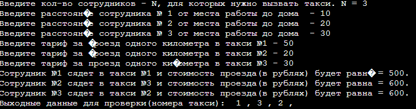
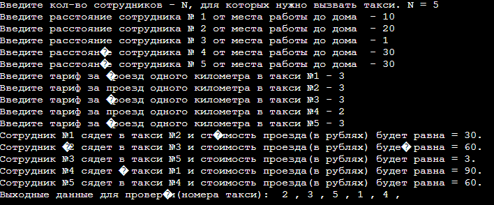

#Lab4
## Программа ТАКСИ
_____
### Описание программы
Программа определяет в какое такси посадить сотрудника N, что бы суммарные затраты на такси были минимальными.

Сначала вводится натуральное число N (1 ≤ N ≤ 1000) — количество сотрудников компании (совпадающее с количеством вызванных машин такси).

Далее записано N чисел, задающих расстояния в километрах от работы до домов сотрудников компании (первое число — для первого сотрудника, второе — для второго и т.д.). Все расстояния — положительные целые числа, не превышающие 1000.

Далее записано еще N чисел — тарифы за проезд одного километра в такси (первое число — в первой машине такси, второе — во второй и т.д.). Тарифы выражаются положительными целыми числами, не превышающими 10000.

Выводится N чисел. Первое число — номер такси, в которое должен сесть первый сотрудник, второе число — номер такси, в которое должен сесть второй и т.д., чтобы суммарные затраты на такси были минимальны.
_____
### Скриншоты выходных данных
#### Тестовые данные 1

#### Тестовые данные 2

_____
### Среда разработки
Программа написана на языке С++. Программу можно запустить через онлайн-компилятор [OnlineJBD](https://onlinegdb.com/3_cKD--9w)
